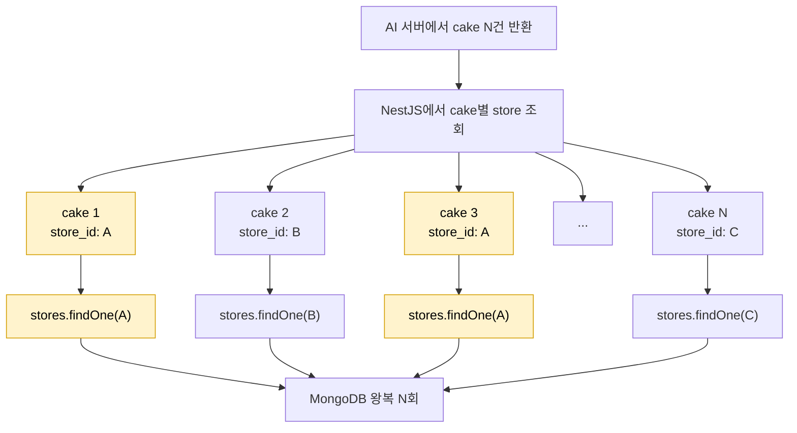
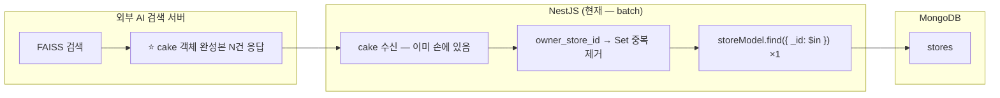

# 유사 케이크 조회 API에서 N+1 문제를 개선하며 얻은 성능 최적화 인사이트

유사 케이크 조회 API는 외부 AI 검색 서버에서 비슷한 cake 목록을 받아온 뒤, 각 cake에 store 정보를 붙여 응답한다.

처음에는 cake마다 store를 하나씩 조회했다. 구현은 단순했지만 cake 수가 늘어날수록 store 조회도 같이 늘었다. 같은 store를 여러 cake가 참조해도 매번 다시 조회했다.

## 목차

1. [문제 상황: cake 수만큼 store 조회가 늘어났다](#1-문제-상황-cake-수만큼-store-조회가-늘어났다)
2. [먼저 결론: `$in` batch를 활용해 동일 store 중복 조회를 제거](#2-먼저-결론-in-batch를-활용해-동일-store-중복-조회를-제거)
3. [검토한 해결책 3가지](#3-검토한-해결책-3가지)
4. [어떻게 측정했나](#4-어떻게-측정했나)
5. [측정 결과](#5-측정-결과)
6. [왜 비정규화를 선택하지 않았나](#6-왜-비정규화를-선택하지-않았나)
7. [왜 `$lookup`을 선택하지 않았나](#7-왜-lookup을-선택하지-않았나)
8. [최종적으로 `$in` batch를 선택한 이유](#8-최종적으로-in-batch를-선택한-이유)
9. [언제 다시 검토할 것인가](#9-언제-다시-검토할-것인가)
10. [요약 정리](#10-요약-정리)

## 1. 문제 상황: cake 수만큼 store 조회가 늘어났다

유사 케이크 조회 API의 응답에는 cake 정보뿐 아니라 해당 cake를 판매하는 store 정보도 필요했다.

응답에 필요한 store 정보는 store 이름, 주소, taste, 위도, 경도였다. 그런데 외부 AI 검색 서버가 내려주는 cake 데이터에는 store 전체 정보가 아니라 `owner_store_id`만 들어 있었다.

그래서 기존 코드는 cake를 순회하면서 각 cake의 store를 하나씩 조회했다.

```ts
const cakeResponse = await Promise.all(
  cakes.map(async (cake) => {
    const store = await this.storeService.findOne(cake.owner_store_id, user);
    return new CakeSimilarResponseDto(cake, new StoreSimpleResponseDto(store));
  }),
);
```

흐름만 보면 자연스럽다.

1. 외부 AI 검색 서버에서 cake N건을 받아온다.
2. cake를 하나씩 순회한다.
3. 각 cake의 `owner_store_id`로 store를 조회한다.
4. cake와 store를 합쳐 응답 DTO를 만든다.

문제는 이 구조가 cake 수에 비례해서 store 조회를 만든다는 점이다.



cake가 10개면 store 조회도 10번 발생한다. cake가 50개면 store 조회도 50번 발생한다.
또 여러 cake가 동일한 store를 참조하면 매번 개별 조회가 수행되어 불필요한 중복 쿼리가 발생한다.

## 2. 먼저 결론: `$in` batch를 활용해 동일 store 중복 조회를 제거

최종 선택은 `$in` batch였다.

cake마다 store를 조회하지 않고, 먼저 cake 목록에서 `owner_store_id`를 모은 후 `Set`으로 중복을 제거하고 MongoDB의 `$in` 조건으로 필요한 store를 한 번에 조회한다.

```ts
const storeIds = [
  ...new Set(cakes.map((cake) => cake.owner_store_id).filter(Boolean)),
];

const stores = await this.storeModel.find({
  _id: {
    $in: storeIds,
  },
});

const storeMap = new Map(stores.map((store) => [store._id.toString(), store]));

const cakeResponse = cakes
  .map((cake) => {
    const store = storeMap.get(cake.owner_store_id);

    if (!store) {
      return null;
    }

    return new CakeSimilarResponseDto(cake, new StoreSimpleResponseDto(store));
  })
  .filter((cake) => cake !== null);
```

핵심은 반복문 안에서 DB 조회를 하지 않는 것이다. 반복문은 응답을 조립하는 역할만 맡고, store 조회는 반복문 밖에서 한 번에 끝난다.

이렇게 바꾸면 store 조회가 cake 개수만큼 늘어나지 않는다. 같은 store가 여러 번 등장해도 `Set`이 중복을 제거하므로 조회 대상에는 한 번만 들어간다.

측정 결과 size=100, 중복도 low 기준 current의 hydration P95는 9.25ms였고, `$in` batch는 3.12ms였다. 중복도 high에서는 batch가 0.66ms까지 내려갔다.

가장 빠른 방식은 아니었지만 현재 조건에서는 `$in` batch가 충분히 빨랐고, 코드 변경 범위와 운영 부담이 가장 작아 이 방식을 골랐다.

## 3. 검토한 해결책 3가지

검토한 다른 해결책 후보는 3가지였다.

| 방식        | 설명                         | 장점                         | 부담                               |
| ----------- | ---------------------------- | ---------------------------- | ---------------------------------- |
| `$in` batch | store id를 모아 한 번에 조회 | 변경 범위 작음, DB 왕복 1회  | storeMap 구성 필요                 |
| `$lookup`   | aggregate로 cake-store join  | DB에서 조인 처리             | 현재 AI 서버 응답 흐름과 맞지 않음 |
| 비정규화    | cake에 store snapshot 저장   | 읽기 경로에서 store 조회 0회 | 쓰기 fan-out, 일관성 관리 필요     |

세 방식 모두 같은 문제를 풀지만 해결하는 위치가 다르다.

1. `$in` batch는 애플리케이션에서 필요한 store id를 모은 뒤 DB에 한 번만 요청한다. 현재 코드 흐름을 크게 바꾸지 않고 N+1을 없앤다.

2. `$lookup`은 MongoDB aggregate에서 cake와 store를 조인한다. DB 안에서 한 번에 처리하지만, 현재 유사 케이크 조회 API에서는 외부 AI 검색 서버가 이미 cake 객체를 완성해서 NestJS에 넘겨준다. 이 상태에서 `$lookup`을 쓰려면 받은 cake를 다시 MongoDB에서 조회하거나, AI 서버의 응답 계약을 바꿔야 한다.

3. 비정규화는 cake 문서 안에 store snapshot을 저장한다. 읽기 성능은 가장 좋지만, store 정보가 바뀔 때 해당 store를 참조하는 모든 cake 문서를 함께 갱신해야 한다.

## 4. 어떻게 측정했나

측정 지표는 다음으로 좁혔다.

- hydration P95
- store call 수
- wire-level command 수
- size, 중복도, skew에 따른 변화

반복 조건은 iter 100회, warmup 10회였다. size는 10, 50, 100을 중심으로 봤고, batch 한계를 보려고 stress test에서는 200, 500, 1000까지 올렸다.

측정 레이어는 두 층으로 나눴다.



첫 번째는 Mongoose 레이어다. `mongoose.set('debug', fn)`로 Model 호출을 캡처했다. 애플리케이션 코드에서 store 조회가 몇 번 발생하는지 확인하는 기준이다.

두 번째는 MongoDB driver 레이어다. `commandStarted` 이벤트로 실제 MongoDB에 나간 command 수를 캡처했다. ORM에서 쿼리 1번으로 보이는 작업이 실제 네트워크 round-trip에서도 1번인지 확인하기 위해서다.

이 두 층을 같이 본 이유는 ORM의 추상화만 믿으면 실제 비용을 놓치기 쉽기 때문이다. Mongoose에서는 쿼리 1번으로 보이더라도 MongoDB wire-level에서는 추가 command가 나갈 수도 있다.

이번 측정에서는 current의 `findOne` N회와 batch의 `find` 1회가 Mongoose 레이어와 driver 레이어에서 동일하게 확인됐다.

## 5. 측정 결과

먼저 hydration P95 결과다.

| size | dup  | current | batch | lookup | denorm |
| ---: | ---- | ------: | ----: | -----: | -----: |
|   10 | low  |    1.73 |  1.03 |   3.85 |   0.00 |
|   10 | mid  |    0.91 |  0.54 |   2.02 |   0.00 |
|   10 | high |    0.79 |  0.46 |   1.03 |   0.00 |
|   50 | low  |    5.25 |  1.99 |   5.68 |   0.00 |
|   50 | mid  |    5.38 |  0.81 |   5.81 |   0.00 |
|   50 | high |    5.30 |  0.43 |   6.24 |   0.00 |
|  100 | low  |    9.25 |  3.12 |   7.97 |   0.00 |
|  100 | mid  |    8.87 |  1.95 |   7.71 |   0.00 |
|  100 | high |    8.78 |  0.66 |   6.94 |   0.01 |

current는 size가 커질수록 거의 선형으로 증가했다. 중복도에는 거의 반응하지 않았다. size=100에서 low, mid, high가 각각 9.25ms, 8.87ms, 8.78ms로 비슷했다.

반면 batch는 중복도가 높아질수록 빨라졌다. size=100 기준 low에서는 3.12ms였지만 high에서는 0.66ms였다. 중복 store id를 제거한 뒤 `$in`으로 조회하기 때문에 실제 조회 대상 store 수가 줄어든 영향이다.

다음은 같은 조건의 100회 누적 store call 수다.

| size | current | batch | lookup | denorm |
| ---: | ------: | ----: | -----: | -----: |
|   10 |   1,000 |   100 |    100 |      0 |
|   50 |   5,000 |   100 |    100 |      0 |
|  100 |  10,000 |   100 |    100 |      0 |

N+1의 핵심은 latency보다 먼저 호출 수가 size에 비례한다는 구조였다. batch는 이 구조를 1회 조회로 바꿨다. 100회 반복 기준으로 보면 current는 size에 따라 1,000회, 5,000회, 10,000회로 늘었지만 batch는 항상 100회였다.

batch의 한계도 확인했다. size를 200, 500, 1000까지 올리고 분포를 uniform, zipf, hotspot으로 나눠 측정했다.

| size | skew    | unique stores | hydration P95 |
| ---: | ------- | ------------: | ------------: |
|  200 | uniform |           200 |       10.60ms |
|  500 | uniform |           500 |       17.56ms |
| 1000 | uniform |          1000 |       31.02ms |
|  200 | zipf    |            91 |        5.75ms |
|  500 | zipf    |           206 |       10.01ms |
| 1000 | zipf    |           386 |       13.16ms |
|  200 | hotspot |            21 |        1.57ms |
|  500 | hotspot |            51 |        2.45ms |
| 1000 | hotspot |           101 |        5.72ms |

uniform에서 size=1000일 때 batch P95가 31ms까지 올라갔다. 같은 size에서도 zipf는 13.16ms, hotspot은 5.72ms였다.

batch 비용을 결정하는 것은 cake 수 자체보다 unique store 수였다. 현실 트래픽은 완전한 uniform보다 특정 인기 매장에 몰리는 zipf나 hotspot에 가까울 가능성이 높다고 봤다.

메모리도 봤다. size=1000 batch 한 cycle에서 총 heap delta는 약 28MB였고, 그중 약 27MB가 mongoose Document overhead였다.

| 단계                                        | heap delta |
| ------------------------------------------- | ---------: |
| mock cakes 1000개 생성                      |      429KB |
| `storeModel.find({_id: $in})` 결과 storeMap |   27,110KB |
| Response DTO 1000건 생성                    |      216KB |
| `JSON.stringify(responses)`                 |      614KB |
| 합계                                        |   28,369KB |

이 부분은 `.lean()`을 적용하면 줄일 여지가 있다. 다만 이번 측정은 운영 코드와 같은 조건을 보려고 그대로 두었다.

## 6. 왜 비정규화를 선택하지 않았나

비정규화는 읽기 성능만 보면 가장 좋았다.

cake 문서 안에 `owner_store_snapshot`을 저장해두면 유사 케이크 조회 시 store를 따로 조회하지 않아도 된다. 실제 측정에서도 denorm의 hydration P95는 거의 0ms였고, store call 수는 0이었다.

다만 이 0회의 대가가 있다.

store 정보가 바뀌면 그 store를 참조하는 모든 cake 문서를 함께 갱신해야 한다. 읽기 경로의 비용을 쓰기 경로로 옮기는 선택이다.

예를 들어 store 이름이나 주소가 바뀌었는데 cake 안의 snapshot을 갱신하지 못하면, 응답에는 오래된 store 정보가 내려간다. store update와 cake `updateMany` 사이에 짧은 불일치 구간이 생기고, 트랜잭션을 쓰지 않는다면 이 일관성 책임은 애플리케이션이 떠안는다.

측정에서는 매장당 cake 1000건 기준 `updateMany` P95가 9.73ms였다. `owner_store_id` 인덱스 덕분에 비용이 완전히 선형으로 폭증하지는 않았지만, store 변경이 잦아진다면 이 비용은 계속 누적된다.

현재 조건에서는 `$in` batch만으로도 hydration P95가 충분히 낮았다. size=100, low 기준 3.12ms였고, high에서는 0.66ms였다.

그래서 비정규화는 나빠서 제외한 것이 아니다. batch가 충분히 빨랐기 때문에 쓰기 fan-out과 애플리케이션 레벨 일관성 책임을 새로 들일 이유가 작았다.

## 7. 왜 `$lookup`을 선택하지 않았나

`$lookup`도 N+1을 줄인다. wire-level command 수만 보면 batch와 마찬가지로 1회로 묶인다.

다만 이번 API에서는 `$lookup`이 구조적으로 자연스럽지 않았다.

현재 유사 케이크 조회 흐름은 이렇다.

1. 외부 AI 검색 서버가 FAISS와 MongoDB를 사용해 유사 cake를 찾는다.
2. AI 서버가 cake 객체를 완성해서 NestJS에 반환한다.
3. NestJS는 이미 받은 cake에 store 정보만 붙인다.

이 상태에서 `$lookup`을 쓰려면 둘 중 하나를 해야 한다.

1. 이미 받은 cake를 버리고 MongoDB에서 같은 cake를 다시 aggregate한다.
2. AI 서버가 cake 객체가 아니라 cake id만 반환하도록 서비스 간 계약을 바꾼다.

첫 번째는 같은 데이터를 다시 조회하는 중복이다. 두 번째는 외부 AI 서버와 NestJS 사이의 인터페이스 변경이다.

`$lookup`을 선택하지 않은 핵심 이유는 단순히 느려서가 아니다. 현재 시스템 경계와 맞지 않았다.

물론 측정상으로도 `$lookup`은 batch보다 일관되게 느렸다. size=100, high 조건에서 batch P95는 0.66ms였고 lookup은 6.94ms였다.

wire-level round-trip은 둘 다 1회였지만 server-side 비용이 달랐다. `$lookup`은 aggregation framework에 진입하고, `owner_store_id`가 String인 현재 구조에서는 pipeline 안에서 `$toObjectId` 변환도 필요했다.

```js
$lookup: {
  from: 'stores',
  let: { storeId: { $toObjectId: '$owner_store_id' } },
  pipeline: [{ $match: { $expr: { $eq: ['$_id', '$$storeId'] } } }],
  as: 'store'
}
```

반면 batch에서는 `storeModel.find()`를 호출할 때 Mongoose가 schema를 보고 String을 ObjectId로 자동 cast해준다. aggregate pipeline 안에서는 이 자동 cast가 적용되지 않는다.

정리하면 `$lookup`은 성능 수치와 별개로 현재 API 흐름과 책임 경계에 맞지 않았다.

## 8. 최종적으로 `$in` batch를 선택한 이유

최종 선택은 `$in` batch였다.

이 방식은 가장 빠른 선택지는 아니다. 읽기 성능만 보면 비정규화가 더 빠르다. DB 안에서 조인까지 처리한다는 관점에서는 `$lookup`도 후보가 된다.

다만 이번 조건에서 중요한 기준은 "가장 빠른 방식"이 아니라 "현재 구조에서 충분히 빠르면서 운영 부담이 작은 방식"이었다.

`$in` batch를 선택한 이유는 다음과 같다.

- DB 왕복을 N회에서 1회로 줄인다.
- 같은 store의 중복 조회를 제거한다.
- 기존 AI 서버 응답 흐름을 바꾸지 않아도 된다.
- store 변경 시 cake 문서를 함께 갱신하는 쓰기 fan-out이 없다.
- 코드 변경 범위가 store id 수집, `$in` 조회, `Map` 매칭 정도로 작다.
- 측정 결과 현재 size와 중복도 조건에서 hydration P95가 충분히 낮았다.

batch는 모든 비교 차원에서 압도적인 1등은 아니다. 대신 반대 방향의 큰 손해가 없었다.

현재 구조에서는 이 균형이 가장 중요했다.

## 9. 언제 다시 검토할 것인가

`$in` batch가 항상 정답은 아니다.

이번 선택은 현재 운영 범위와 현재 API 구조 안에서 내린 결론이다. 아래 조건이 바뀌면 다시 검토한다.

| 조건                                                   | 우선 검토              |
| ------------------------------------------------------ | ---------------------- |
| size가 200을 자주 넘고 uniform 분포가 빈번함           | `.lean()` 적용         |
| `.lean()` 이후에도 반복 조회 비용이 큼                 | Redis TTL cache        |
| store 정보가 매우 자주 조회되는 hot field가 됨         | 비정규화               |
| store 변경이 잦거나 매장당 cake 수가 크게 늘어남       | 비정규화 재검토에 신중 |
| cake 조회 흐름이 AI 서버가 아니라 NestJS 중심으로 바뀜 | `$lookup`              |

특히 stress test에서 size=1000 uniform 기준 batch P95가 31.02ms까지 올라갔다. 이 분포가 실제 트래픽에서 자주 나타난다면 지금의 판단은 다시 봐야 한다.

반대로 현실 트래픽이 zipf나 hotspot에 가깝다면 같은 size에서도 unique store 수가 줄어 batch 비용은 훨씬 낮아진다.

판단 기준은 단순히 "P95가 몇 ms 이하인가"가 아니었다. 어떤 조건이 바뀌면 어떤 선택지를 다시 볼 것인지까지 정해두는 쪽이 더 중요했다.

## 10. 요약 정리

> - 유사 케이크 조회 API에서 cake 수만큼 store 조회가 늘어나는 N+1 문제가 있었다.
> - `$in` batch로 store id를 모아 한 번에 조회하면서 DB 왕복을 N회에서 1회로 줄였다.
> - `$lookup`, 비정규화도 함께 비교했지만 현재 구조에서는 `$in` batch가 가장 균형 잡힌 선택이었다.
> - 비정규화는 가장 빨랐지만 쓰기 fan-out과 데이터 일관성 관리 부담이 컸다.
> - `$lookup`은 성능보다 현재 AI 서버와 NestJS 사이의 책임 경계가 맞지 않았다.
